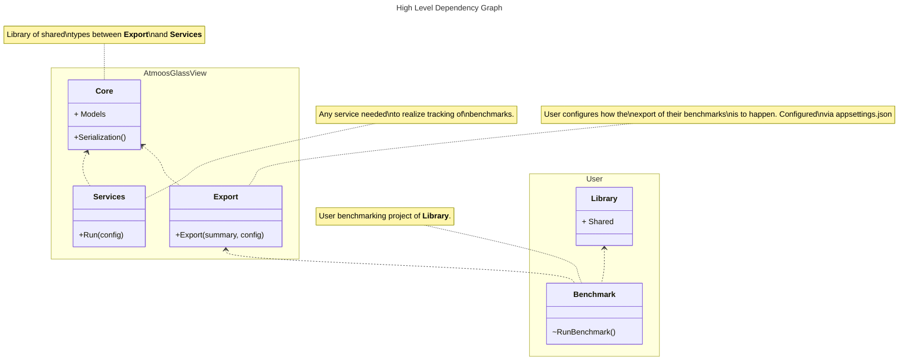

# BenchView Design

```mermaid
---
title: High Level Dependency Graph
---
classDiagram
    Core <.. Services
    Core <.. Export
    Export <.. Benchmark
    Library <.. Benchmark
    namespace AtmoosGlassView {
        class Core{
            + Models
            +Serialization()
        }
        class Services{
            +Run(config)
        }
        class Export{
            +Export(summary, config)
        }
    }

    namespace User {
        class Library{
            + Shared
        }
        class Benchmark{
            ~RunBenchmark()
        }
    }
    note for Core "Library of shared\ntypes between <b>Export</b>\nand <b>Services</b>"
    note for Services "Any service needed\nto realize tracking of\nbenchmarks."
    note for Export "User configures how the\nexport of their benchmarks\nis to happen. Configured\nvia appsettings.json"
    note for Benchmark "User benchmarking project of <b>Library</b>."
```
